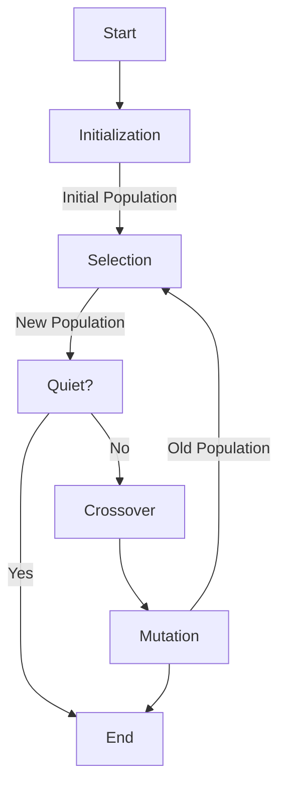

## Problem Description
This project aims to find the solution of a specific mathematical equation using **Genetic Algorithm** (GA). 

The given equation is a mathematical expression containing variables `x` and arimethic operations, trigonometric function, exponential functions and other calculations.
    
You can find the rules for input here: [Input Syntax](#input-syntax)

For example, we have an expression: 

$f(x) = x^2 + log_{50}(\frac{x}{5} + \frac{1}{x}) + sin(x^2+1) - 5.5x $


> The goal is to find the value of variable $x$ such that the function $f(x)$ approaches 0. Here, we find that if $x=x_0$ then $f(x_0) \approx 1.38 \times 10^{-9}$, so we can conclude $x_0$ is a solution.

### Input
- String of the function. The user have to follow the function entry rules in the section [Input Syntax](#input-syntax)

- Example:

    `x^2 + log((x/5 + 1/x), 50) + sin(x^2 + 1) + sqrt(x^2 + 1) - 5.5 * x`

### Output
- If we find the value $x_0$ such that $f(x_0) \approx 0$ or $f(x_0) < 10^{-8}$ then we can conclude that $x_0$ is 1 solution of $f(x)$.

- Otherwise, we conclude there is no solution of the given equation.

## Input Syntax

|Function|Description|
|:-:|-|
|`+`, `-`, `*`, `/`|Add, Minus, Product, Divide respectively|
|`a ^ n`, `a ** n`|`a` to the power `n`|
|`e`|Return Euler's number (`2.7182...`)|
|`pi`|Return PI (`3.1415...`)|
|`sin(x: required)`|Return the sine of a number `x`|
|`cos(x: required)`|Return the cosine of a number `x`|
|`tan(x: required)`|Return the tangent of a number `x`|
|`cot(x: required)`|Return the cotangent of a number `x`|
|`log(x: required, base: optional)`|Return the logarithm of a number `x` to `base`. The default `base` is 10|
|`arcsin(x: required)`|Return the arc sine of a number `x`|
|`arccos(x: required)`|Return the arc cosine of a number `x`|
|`arctan(x: required)`|Return the arc tangent of a number `x`|
|`arccot(x: required)`|Return the arc cotangent of a number `x`|
|`ln(x: required)`|Return the natural logarithm of a number `x`|
|`sqrt(x: required)`|Return the square root of a number `x`|
|`nroot(x: required, nth: required)`|Return the $n^{th}$ root of a number `x`|
|`abs(x)`|Return the absolute value of a number `x`|
|`factorial(n: required)`|Return the factorial of a number `x` (equal to `n!`)|


## Genetic Algorithm



## Installation

- Open the terminal clone the project using command:
    ```
    git clone https://github.com/dtruong46me/genetic-solver-equation.git
    ```

- Go to repository
    ```
    cd genetic-solver-equation
    ```

- Execute program
    ```
    python main/main.py
    ```

## Contributions

- **Instructor:** Assoc. Prof. Tran Dinh Khang

- **Students:**
    |No.|Name|Student ID|Email|
    |:-:|-|:-:|-|
    |1|Dinh Nguyen Cong Quy|20214927|quy.dnc214927@sis.hust.edu.vn|
    |2|Nguyen Trung Truc|20214936|truc.nt214936@sis.hust.edu.vn|
    |3|Phan Dinh Truong|20214937|truong.pd214937@sis.hust.edu.vn|