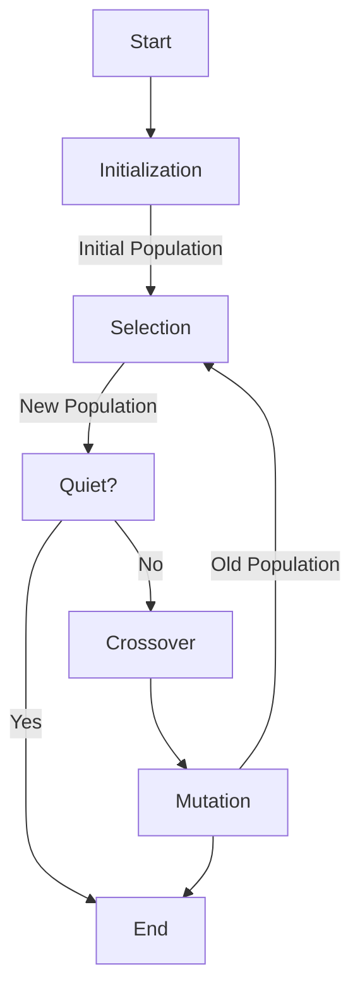

## Problem Description
This project aims to find the solution of a specific mathematical equation using **Genetic Algorithm** (GA). 

The given equation is a mathematical expression containing variables `x` and arimethic operations, trigonometric function, exponential functions and other calculations.
    
You can find the rules for input here: [Mathematical Functions](https://docs.python.org/3/library/math.html)

For example, we have an expression: 

$f(x) = x^2 + log_{50}(\frac{x}{5} + \frac{1}{x}) + sin(x^2+1) - 5.5x $

> The goal is to find the value of variable $x$ such that the function $f(x)$ approaches 0. Here, we find that if $x=x_0$ then $f(x_0) \approx 1.38 \times 10^{-9}$, so we can conclude $x_0$ is a solution.

### Input
- String of the function. The user have to follow the basic function entry rules.

- Example:

    `x^2 + log((x/5 + 1/x), 50) + sin(x^2 + 1) + sqrt(x^2 + 1) - 5.5 * x`

### Output
- If we find the value $x_0$ such that $f(x_0) \approx 0$ or $f(x_0) < 10^{-8}$ then we can conclude that $x_0$ is 1 solution of $f(x)$.

- Otherwise, we conclude there is no solution of the given equation.

## Genetic Algorithm



## Installation

- Open the terminal clone the project using command:
    ```
    git clone https://github.com/dtruong46me/genetic-algorithm.git
    ```

- Open file `genetic-solver-equation/main/main.py` and execute it.

## Contributions

- **Instructor:** Assoc. Prof. Tran Dinh Khang

- **Students:**
    |No.|Name|Student ID|Email|
    |:-:|-|:-:|-|
    |1|Dinh Nguyen Cong Quy|20214927|quy.dnc214927@sis.hust.edu.vn|
    |2|Nguyen Trung Truc|20214936|truc.nt214936@sis.hust.edu.vn|
    |3|Phan Dinh Truong|20214937|truong.pd214937@sis.hust.edu.vn|